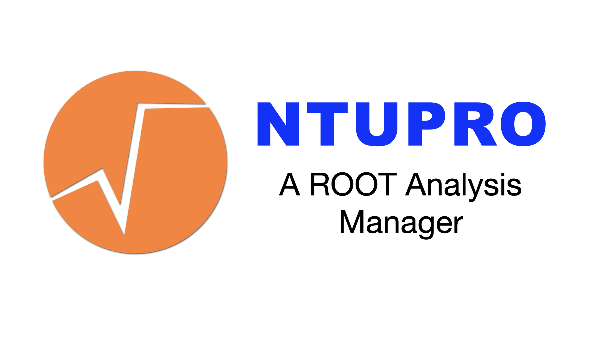

Based on [ROOT](https://ph-root-2.cern.ch/) [RDataFrame](https://root.cern/doc/master/classROOT_1_1RDataFrame.html), NTupro is an innovative Python package which takes care of optimizing HEP analyses.

## Structure

## Examples

## Tests
Before merging, check that all the tests are green by running

```bash
$ python -m unittest -v
```
