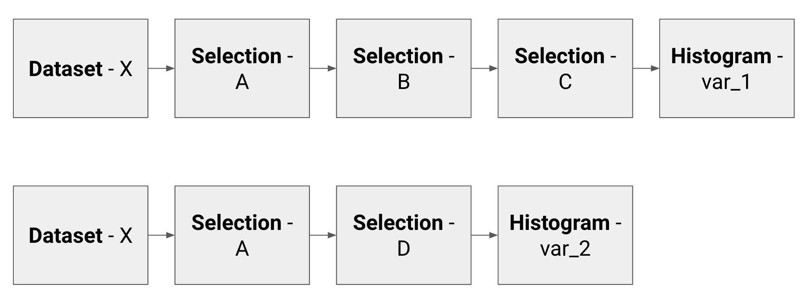
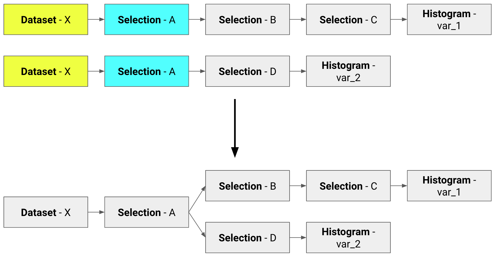

Based on [ROOT](https://ph-root-2.cern.ch/) [RDataFrame](https://root.cern/doc/master/classROOT_1_1RDataFrame.html), NTupro is an innovative Python package which takes care of optimizing HEP analyses.  

## Motivation
Cut-based analyses in HEP foresee a series of operations that are more or less common:

* a dataset is accessed;
* cuts are performed on one or more variables;
* the variables of interest, whose events passed the above mentioned selections, are plotted.

This series of operations make what we can call a minimal analysis flow unit. In a typical HEP analysis, given the amount of datasets, cuts and plots that we want to produce, we have to handle hundreds of thousands of these units. Two basic examples of analysis units are here shown.

To produce their results, many physicists use the so called [TTree::Draw](https://root.cern.ch/doc/master/classTTree.html) approach: it is simple because it allows not to write the **event loop** explicitly, but it has the drawback that the analysis units are run *sequentially*. This leads to the following weak spots:

* same datasets (e.g. Dataset-X above) are fetched and decompressed multiple times;
* same subsets of cuts (e.g. Selection-A above) are applied many times on different datasets;
* the event loop is run once per histogram.

Implementing a clean and friendly API to [RDataFrame](https://root.cern/doc/master/classROOT_1_1RDataFrame.html), NTupro allows to write minimal analysis flow units and automatically optimizes them, performing common operations only once, like in the following.

  
## Structure  
NTupro is divided into three main parts, here briefly summarized and described in detail in the following subsections:

* **Book Results**: for every histogram that we want to produce, we declare initial dataset, cuts, weights and systematic variations that need to be applied;
* **Optimize Computations**: datasets, selections and histograms are treated as nodes of a graph; the common once are merged to perform every action only once;
* **Run Computations**: the previous graphs are converted to the language of RDataFrame and the event loop is run; *multiprocessing* and *multithreading* facilities are here implemented.

### Book Results
In this first abstraction layer, the idea is to book all the histograms that we want to produce, declaring for each of them the set of ntuples from which it is taken, the set of cuts and weights applied and the systematic variations. To do so, the following classes are introduced:

* `Dataset`:  structure containing a set of ntuples names (see class `NTuple` below) where we expect to fetch the variable we want to plot;
```python
class Dataset:
    name = 'dataset_name'
    ntuples = [ntuple1, ntuple2, ...]
class Ntuple:
    path = 'path_to_file.root'
    directory = 'tree_name'
    # Friends are other instances of Ntuple
    friends = [friend1, friend2, ...]
```
* `Selection`: structure containing two lists, one for the cuts we want to apply to the dataset and one for the weights applied to the histogram; organizing cuts and weights in these logical blocks makes sense from the analysis point of view, since it allows to encode the physics knowledge about channels, processes, ecc.; more than one selection can be applied;
```python
class Selection:
    name = 'selection_name'
    cuts = [('cut1_name', 'cut1_expression'), ...]
    weights = [('weight1_name', 'weight1_expression'), ...]
```
* `Action`: structure that represents the results that can be extracted when the event loop is run; the two classes that inherit from it are `Histogram` and `Count`, the former containing the variable we want to plot and the list of edges of the histogram, the latter representing the sum of weights.
```python
class Action:
    name
    variable
class Count(Action):
    pass
class Histogram(Action):
    name = 'histogram_name'
    variable = 'variable_to_plot'
    edges = [edge1, edge2, ...]
```
Instances of the above mentioned classes are passed as arguments to the class `Unit`, which represents a minimal analysis flow unit, i.e. dataset where the events are stored, selections applied and actions we want to perform.
```python
class Unit:
    dataset = dataset_object
    selections = [selection1, selection2, ...]
    actions = [histogram1, histogram2, ...]
```
In this step also the systematic variations are booked. The base class is `Variation`, from which the following classes inherit:

* `ChangeDataset`: create a copy of the target `Unit` object with a different `Dataset` block;
```python
class ChangeDataset:
    name = 'variation_name'
    folder_name = 'new_dataset_name'
    def create(target_unit):
        return Unit(new_dataset,
        target_unit.selections,
        target_unit.actions)
```
* `AddWeight`, `ReplaceWeight`, `SquareWeight`, `RemoveWeight`: create a copy of the target `Unit` object with a different (or one more) `Selection` block containing a different list of weights;
* `AddCut`, `ReplaceCut`, `RemoveCut`: create a copy of the target `Unit` object with a different (or one more) `Selection` block containing a different list of cuts.

In general, the way systematic variations operate is to create copies of `Unit` objects with some differences in the blocks they are made of. Units are managed and booked, along with the systematic variations, by setting a `UnitManager` object.
```python
class UnitManager:
    booked_units = []
    def book_units(units, variations):
        # Book units and apply variations
```

### Optimize Computations 
In this stage, the goal is to merge the Units (*paths*) into *directed graphs*. The blocks that make the Units introduced in the previous part (i.e. Datasets, Selections and Actions) are treated as nodes of a graph. The common ones are merged in order to perform every action only once. At the end of this step, we end up with a set of trees. It is worth pointing out that there is a one-way relationship between graphs and datasets at the end of this step, i.e. we do not have two graphs with the same `Dataset` node.
Three levels of optimization are implemented:

* optimization 0: no optimization is implemented and the new software behaves like the current one;
* optimization 1: only `Dataset` nodes are merged;
* optimization 2: both `Dataset` and `Selection` nodes are merged.

These steps bring a different amount of improvement.

### Run Computations
In this stage the ROOT facilities come into play. The optimized graphs created in the previous stage are converted into RDataFrame computational graphs. More specifically, each node of an abstract graph corresponds to a RDataFrame node type (e.g. `Filter`, `Histo1D`, etc.). The recursive function returns a list of pointers to the histograms for each graph. The event loop is run only at the end, once for each graph.
In this stage two parallelization techniques are introduced: 
 * *multithreading* is enabled with a call to the function `RDataFrame::EnableImplicitMT()`;
* *multiprocessing* is enabled with the homonymous Python package; in this fashion, a pool of workers is set and the RDataFrame objects on which the event loop has to be run are sent one by one to them; when one of the workers is done, it gets the next object in the buffer.

## Examples

In the following, we report a simple (and completely unrealistic) example that produces three histograms after the application of two systematic variations.

```python {.line-numbers}
from ntuple_processor import Dataset, Unit, UnitManager, GraphManager, RunManager  
  
"""Create a Dataset  
  
my_ntuples is a list of Ntuple objects  
"""  
my_dataset = Dataset('my_dataset', my_ntuples)  
  
"""Create a Unit  
  
Remember: a Unit is made by the following elements:  
Dataset - [Selections] - [Histograms]  
"""  
my_unit = Unit(my_dataset, [selection1, selection2], [histo_var1])  
  
# Set a Unit manager  
um = UnitManager()  
  
# Book Units and apply systematic varations  
um.book([my_unit], [sys_variation1, sys_variation2])  
  
# Create graphs from Units  
graph_manager = GraphManager(um.booked_units)  
graph_manager.optimize()  
  
# Run - Convert to RDataFrame  
run_manager = RunManager(graph_manager.graphs)  
run_manager.run_locally('file.root', nworkers = 1, nthreads = 2)
```
  
## Tests  
Before merging, check that all the tests are green by running  
  
```bash  
$ python -m unittest -v  
```
